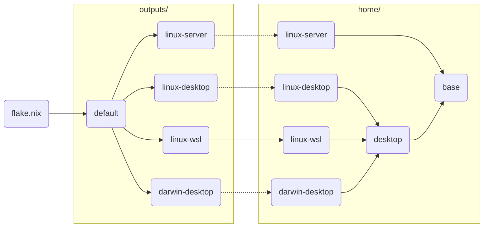

# Yusong's Nix Config

## References

- [Home Manager Option Search](https://home-manager-options.extranix.com/).
- [An unofficial book for beginners](https://nixos-and-flakes.thiscute.world/).

## Screenshots


## Code Structure



## Get Started

### NixOS-WSL

Download `nixos-wsl.tar.gz` from the [latest release](https://github.com/nix-community/NixOS-WSL/releases).

<details><summary>Install WSL and run NixOS with the default configuration.</summary>

```sh
# make sure wsl feature is enabled
wsl --install --no-distribution

# import the tarball into WSL
wsl --import [Distro] [InstallLocation] [FileName]
# for example run the following command
wsl --import NixOS ~/NixOS/ path/to/nixos-wsl.tar.gz

# now you can run NixOS
wsl -d NixOS
```

</details>

Follow the instructions
[How to change the username](https://nix-community.github.io/NixOS-WSL/how-to/change-username.html)
to change username.

<details><summary>Pull this repository and apply the configurations.</summary>

```sh
# generate ssh key pairs
cd ~ && ssh-keygen -t rsa -b 2048
# add pub key to github user settings...

# enter a shell environment with git command included
nix shell --extra-experimental-features "nix-command flakes" nixpkgs#git
# clone this repo under user home directory
git clone git@github.com:whisperpine/nix-config.git
# back up the original /etc/nixos
sudo mv /etc/nixos /etc/nixos.bak
# create a symlink to /etc/nixos
sudo ln -s ~/nix-config /etc/nixos
# create .env file from template
cd ~/nix-config && cp example.env .env
# edit .env (follow the comment inside)
vim .env
# tada
sudo nixos-rebuild switch
```

</details>

### Nix-Darwin

<details><summary>Install nix and apply configurations.</summary>

```sh
# install nix
curl -L https://nixos.org/nix/install | sh
# generate ssh key pairs, add pub key to github user settings...

# clone this repo under user home directory
cd ~ && git clone git@github.com:whisperpine/nix-config.git

# create .env file from template
cd ~/.config/nix-config && cp example.env .env
# edit .env (follow the comment inside)
vim .env

# tada
nix --extra-experimental-features "nix-command flakes" \
  run nix-darwin -- switch --flake ~/.config/nix-config

# now darwin-rebuild is available
darwin-rebuild switch --flake ~/nix-config
```

</details>

Tip: `darwin-help` will open an HTML version of the man-page in the default browser.\
`man 5 configuration.nix` will open the manual of nix-darwin right in the terminal.

## Secret Management

Secrets are managed by [sops-nix](https://github.com/Mic92/sops-nix),
which is based on [sops](https://github.com/getsops/sops).\
Considering [age](https://github.com/FiloSottile/age) is used,
make sure *~/.config/sops/age/keys.txt* exists.

```sh
# decrypt and edit the encrypted file
sops secrets/encrypted.yaml
```
